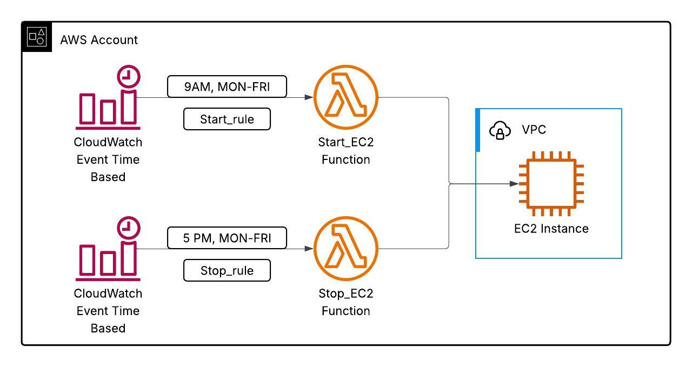

# 🔁 AWS EC2 Start/Stop Automation with CloudWatch Events, Lambda and Terraform

This project automates the **starting and stopping** of an Amazon EC2 instance using **AWS Lambda**, **CloudWatch EventBridge**, and **Terraform**. 
This is ideal for optimizing costs in non-production environments by ensuring EC2 instances only run during working hours (e.g., 9 AM to 5 PM, Monday to Friday).

---

## 🚀 Features

- ✅ Launches an EC2 instance in a custom VPC
- ✅ Deploys two Lambda functions to start and stop the EC2 instance
- ✅ Schedules automated start/stop using EventBridge CRON rules
- ✅ Passes the EC2 instance ID to Lambda via environment variables (no hardcoding)
- ✅ Uses Terraform for full IaC automation

---

## 🏗️ Architecture



---

## Tech Stack

- **Terraform** for IaC
- **AWS Lambda (Python 3.10) using Boto3**
- **Amazon EC2 (Amazon Linux 2)**
- **CloudWatch EventBridge** for scheduling
- **IAM** for permissions

---

## 🚀 Getting Started

### 📦 Prerequisites

- [AWS CLI configured](https://docs.aws.amazon.com/cli/latest/userguide/cli-configure-quickstart.html)
- Terraform ≥ 1.3 installed
- AWS account with appropriate permissions

---

### Project Structure

| File | Description |
|------|-------------|
| `main.tf` | EC2 instance + security group
| `vpc.tf` | VPC, subnet, route tables
| `iam.tf` | IAM roles and policy attachments
| `lambda.tf` | Lambda function + packaging
| `eventbridge.tf` | Scheduled CloudWatch triggers
| `variables.tf` | Input variables
| `outputs.tf` | Outputs (e.g. instance ID)
| `lambda/` | lambda function files

---


---

### Deployment Steps

1. **Clone the repo**
   ```bash
   git clone https://github.com/s-oa18/Terraform-ec2-lambda-automation.git
   cd Terraform-ec2-lambda-automation
   ```

2. **Initialize Terraform**
  ```bash
    terraform init
   ```

3. **Deploy infrastructure**
   ```bash
   terraform plan
   terraform apply
   ```

4. Confirm the EC2 instance and Lambda functions are created in AWS Console.

---

### Testing
***Option 1: Use AWS Console***

- Go to AWS instances and stop the running instance
- Go to AWS Lambda → select start_ec2 function
- Click Test, then configure a basic test event (any dummy event will do, e.g., {}).
- Click Deploy and Test, to execute the function.
- Go to EC2 Console → check if the instance is running.
- Repeat for stop_ec2 function to see if the instance stops.

---
***option 2: Use AWS CLI***
```bash
aws lambda invoke \
  --function-name start_ec2_lambda \
  --payload '{}' \
  start-output.json

aws lambda invoke \
  --function-name stop_ec2_lambda \
  --payload '{}' \
  stop-output.json

```
Confirm in the console if instance started/stopped respectively

---
***Option 3: Test Scheduled Automation (Optional but Ideal)***
Let’s say you want to simulate the schedule manually:

🔁 Change CRON Time for Quick Trigger

You can temporarily update the cron() expressions in your Terraform like this:
```bash
# Change for testing:
# From: cron(0 9 ? * MON-FRI *)
# To:   cron(*/5 * * * ? *)   → every 5 minutes

schedule_expression = "cron(*/5 * * * ? *)"

```
Then re-run
```bash
terraform apply

```
This will help you verify the Lambda triggers on a schedule without waiting until 9AM or 5PM.

---

### CloudWatch Logs
Each Lambda function logs output to CloudWatch Logs:
- Go to CloudWatch > Logs > /aws/lambda/start_ec2 or /stop_ec2
- Useful for debugging EC2 state transitions

---

### Cleanup
To remove all resources:
```bash
terraform destroy

```
